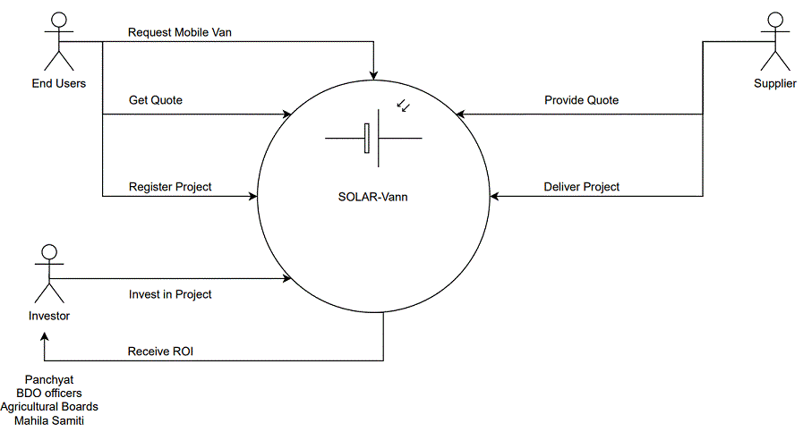
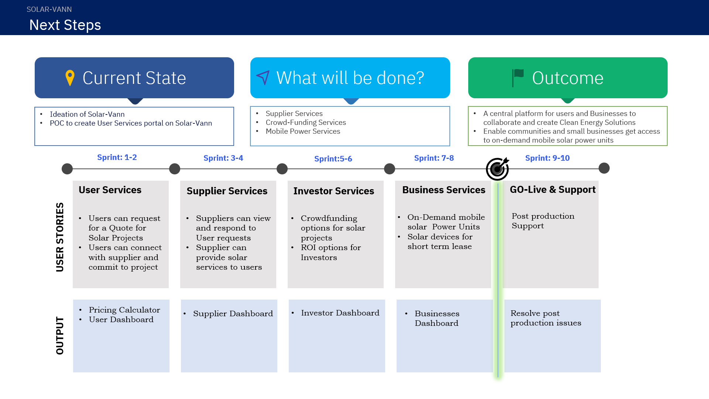

# solarVann
A common platform for solar providers and individuals to come together and create clean energy solutions for the community.

# Table of Contents
 - ### What is Solar-Vann?
 - ### A short demo
 - ### The Architecture
 - ### Components Used
 - ### Detailed Description
 - ### What Next?
 - ### How to get started?
 - ### How to Contribute?

# What is Solar-Vann?
   - ## The problem ?
     Solar solutions have been around for more than a decade now, yet urban and rural India is very dependent on the energy sources provided in big cities and are yet to fully embrace the alternative clean energy solutions. With new regulations by city corporations it has now become imperative to look at clean energy solutions. However this journey towards clean green energy sources is riddled with practical problems starting with heavy investment to finding the right provider who can support our needs to simply not being able to install it.
   
   - ## How can technology help ?
   A common platform for home owners/small businesses and providers alike in urban/rural localities to collaborate and find solutions to solve their energy needs using solar or hybrid solutions. From using mobile solar powered units for quick and short term usage to permanent solutions like roof top installations... end users can now with the help of like minded investors can take on projects to help themselves and the community at large.
   
   - ## The Idea
   A web/mobile based solution to allow users and solar service providers to connect. A one-shop stop for all your solar needs from being able to hire a mobile power unit for short term needs to finding crowd funding options to help setup your very own solar/hybrid projects. This platform aims to bring together end users and suppliers along with investors to realize this journey towards clean green energy.
   
# Demo Video
Here is a demo of the Mobile-Van use case offering from Solar-vann

# The Architecture

  ## Overview
  

  ## System Context
  

# Components Used
- Angular UI app on IBM cloud
- Azure Logic apps (to be replaced with IBM App Connect)
- SQL Database on Azure
- IBM Event Streams is a high-throughput message bus built with Apache Kafka. (TBD)
- IBM Cloud IOT Platform (TBD)
- Automation Runbook on Azure (TBD)
- PowerBI (TBD)

# What next?

# How to get started ?
 ## For Angular UI App
  #### Development server
  - Run `ng serve` for a dev server. Navigate to `http://localhost:4200/`. The app will automatically reload if you change any of the source files.

  #### Code scaffolding
  - Run `ng generate component component-name` to generate a new component. You can also use `ng generate directive|pipe|service|class|guard|interface|enum|module`.
  
  #### Build
  - Run `ng build` to build the project. The build artifacts will be stored in the `dist/` directory. Use the `--prod` flag for a production build.

  #### Running unit tests
  - Run `ng test` to execute the unit tests via [Karma](https://karma-runner.github.io).

  #### Running end-to-end tests
  - Run `ng e2e` to execute the end-to-end tests via [Protractor](http://www.protractortest.org/).
 
  #### Further help
  - To get more help on the Angular CLI use `ng help` or go check out the [Angular CLI Overview and Command Reference](https://angular.io/cli) page.

 ## For Logic App
  - Exposed as an API which is using Azure Resource Manager template along with API connection. Import the tempalte into Azure cloud.
     
 ## For SQL Server
  - Execute SQL script to create Table and insert Solar details data.

# How to Contribute ? 
Please [click here](./contributing.md) for details on our code of conduct, and the process for submitting pull requests to us. 

# Meet the Team.

1. Sormita Chakraborty - sorchakr@in.ibm.com
2. Krithika S Udupa - krsudup1@in.ibm.com
3. Disary Nath - disary.nath.sarkar@ibm.com
4. Sharmishtha Sarkar - sharsark@in.ibm.com
5. Elma Simons - elma.simons@in.ibm.com

